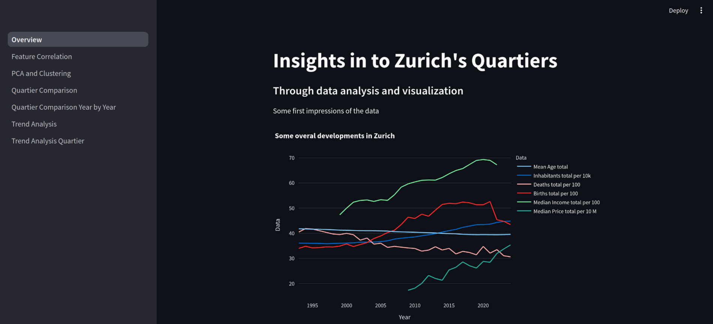
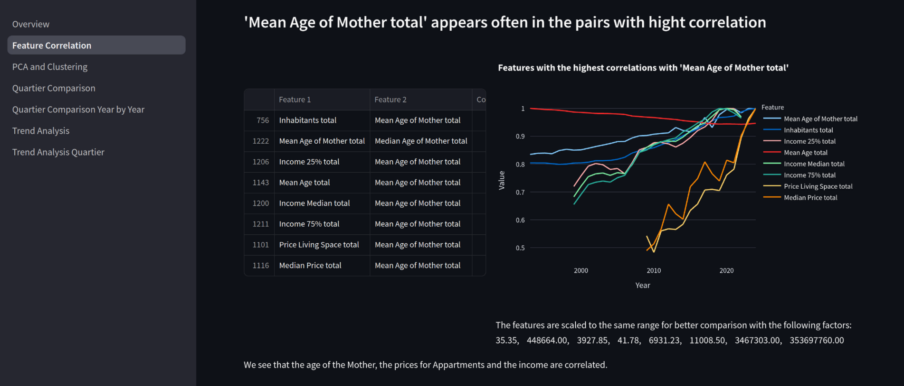
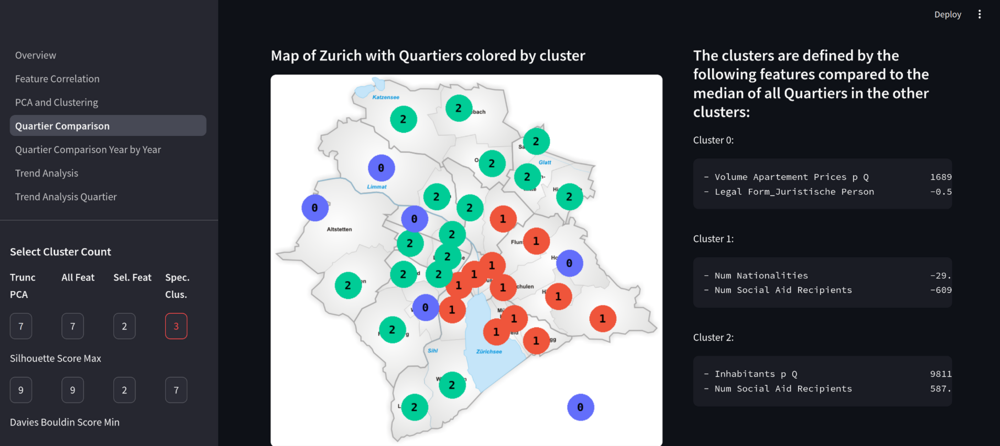
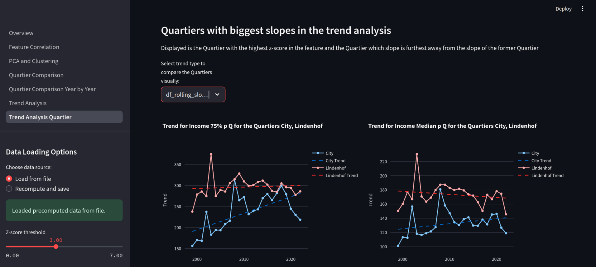

# Zurich Quartiere Data Explorer

This project analyzes and visualizes data from the City of Zurich’s open data catalog ([data.stadt-zuerich.ch](https://data.stadt-zuerich.ch/)), focusing on the city’s Quartiere (neighborhoods). The data spans from 1993 to 2024.

## Features

- **Interactive Streamlit Web App:**  
  Explore differences between Zurich’s Quartiere and how they have changed over time.
- **Clustering & Dimensionality Reduction:**  
  Applied various clustering methods and dimensionality reduction techniques to identify groupings among Quartiere.
- **Feature Analysis:**  
  Identified features that most distinguish Quartiere and those that have changed the most over the years.
- **Trend Analysis:**  
  Highlighted Quartiere that experienced the most significant changes.

## Getting Started

1. Clone this repository.
2. Install requirements:  
   `pip install -r requirements.txt`
3. Run the app:  
   `streamlit run Overview.py`
4. Click trough the pages in order, as they are relying on data computed in previous pages.
5. Enjoy the exploration!

## Impressions

## Data Source

- [Stadt Zürich Open Data Catalog](https://data.stadt-zuerich.ch/)
